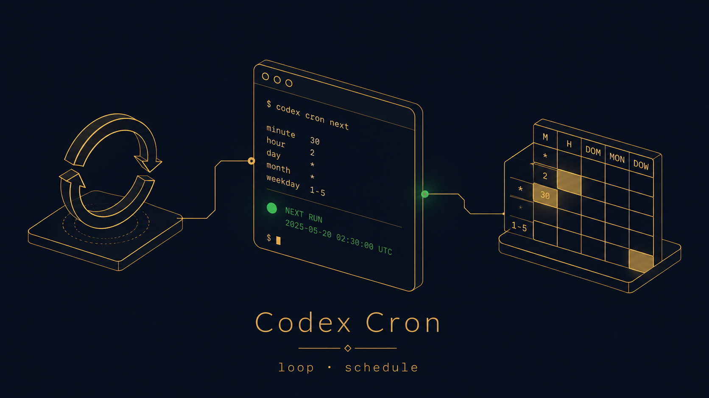

<div align="center">



# Codex Cron

**Cron for your Codex prompts.**
Loop or schedule Codex prompts — locally, safely, from your terminal or tmux.


English | [한국어](README.ko.md) | [中文](README.zh-CN.md) | [日本語](README.ja.md)

</div>

---

Codex runs a prompt **once**. Codex Cron makes it run **on a schedule** — every _N_ minutes, on a cron expression, or once at a set time — and keeps the plumbing honest: a single-runner lock, unbounded run logs, and a safety allowlist that refuses to weaken your sandbox.

For `schedule`, due prompts are delivered with the `auto` runner by default:

1. `tmux-send` — if `--tmux-target` or `TMUX_PANE` points at a running Codex pane, paste the prompt there and press Enter.
2. `resume-command` — if `--resume-command` is provided, run that local hook with the prompt on stdin.
3. `codex-exec` — otherwise fall back to a fresh `codex exec` run for compatibility.

Two tiny, zero-dependency skills:

- **`loop`** — fixed-interval repeats (`10m`, `2h`, `1d`, …)
- **`schedule`** — 5-field cron, plus one-shot `--at <ISO-8601>`

## Install — 2 commands

```bash
codex plugin marketplace add Mineru98/codex-cron-skill
codex plugin add codex-cron@mineru98
```

`loop` and `schedule` are now registered in Codex. That's the whole setup.

## Use it

Just ask Codex — it picks the right skill:

```
loop every 10 minutes: check CI status and ping me if red
schedule "0 9 * * 1": summarize the open PRs and post a digest
run once at 2026-07-04T09:00:00Z: draft the release notes
```

Or name the skill explicitly with `$loop` / `$schedule` when you want deterministic routing:

```
$loop every 10 minutes: check CI status and ping me if red
$schedule "0 9 * * 1": summarize the open PRs and post a digest
$schedule at 2026-07-04T09:00:00Z: draft the release notes
```

Or drive the bundled scripts directly:

```bash
# loop — fire a prompt every 10 minutes
node plugins/codex-cron/skills/loop/scripts/loop.mjs \
  add --state-root .codex/loop --interval 10m \
  --prompt "check CI status" --cwd "$PWD"
node plugins/codex-cron/skills/loop/scripts/loop.mjs daemon --state-root .codex/loop

# schedule — every weekday at 09:00
node plugins/codex-cron/skills/schedule/scripts/schedule.mjs \
  add --state-root .codex/schedule --cron "0 9 * * 1" \
  --prompt "summarize open PRs" --cwd "$PWD"
node plugins/codex-cron/skills/schedule/scripts/schedule.mjs daemon \
  --state-root .codex/schedule \
  --runner auto \
  --tmux-target "$TMUX_PANE"
```

Nothing fires unless a `daemon` is running — it holds a single-runner lock, so you never double-fire.

## Not a toy

- **Single-runner lock** — atomic `mkdir` acquire + rename compare-and-swap reclaim. No duplicate daemons; crash-left locks are recovered safely, never by deleting a live one.
- **Interactive delivery first** — `schedule` prefers tmux prompt injection, then a local resume hook, then `codex exec`. You can force any mode with `--runner tmux-send`, `--runner resume-command`, or `--runner codex-exec`.
- **Safe by default** — `--codex-arg` pass-through is a *default-deny allowlist*. Sandbox / approval / config-bypass flags (`--sandbox danger-full-access`, `--full-auto`, `--dangerously-…`) are refused and never reach `codex exec`.
- **Full run capture** — every run streams unbounded to its own `runs/<taskId>/<ts>.jsonl` + last-message file. No 1 MB truncation, real exit codes preserved.
- **Zero dependencies** — pure Node ESM + `node:test`. 81 tests green (loop 33, schedule 44, app hook 4), including adversarial safety and lock-race cases.
- **No OS cron / launchd** — nothing is installed behind your back. The daemon runs only while you run it.

## loop vs schedule

```
                loop                     schedule
  cadence   fixed interval           5-field cron  |  one-shot --at
  grammar   Ns / Nm / Nh / Nd        m h dom mon dow (·, */n, a-b, lists)
  example   --interval 10m           --cron "0 9 * * 1"   |   --at <ISO>
  state     .codex/loop/             .codex/schedule/
  default   10m if omitted           next cron time  |  fires once, then done
```

Both share the same runner, lock discipline, and safety model — they only differ in *when* a job is due.

## For always-on schedules

For durable, always-on scheduling that survives reboots and closed terminals, use **Codex app Automations** — the official surface. Codex Cron is the **terminal-native local fallback**: perfect for a dev box, a tmux pane, a CI runner, or anywhere you live in the shell.

## Under the hood

- `parse-loop` / `parse-schedule` — validate specs to JSON without touching state
- `add` / `list` / `cancel` / `status` — manage tasks in `tasks.json` (atomic temp+rename writes)
- `run-due` — fire everything due in one pass (great for CI triggers)
- `daemon` — poll on an interval; `--once`, `--max-runs N`, `--poll-ms`, `--runner`, `--codex-bin`, `--tmux-target`, `--resume-command`
- `doctor` — read-only health check (state root, lock, codex binary, local-ignore guidance)

Run state (`tasks.json`, `scheduled_tasks.lock/`, `runs/`) is **local-only** — git-ignore it; never commit it.

## Release notes

- [0.1.0](docs/release-0.1.0.md) — initial loop and schedule skills.
- [0.2.0](docs/release-0.2.0.md) — Codex App hook context loading.

## License

MIT © 2026 Mineru98. See [LICENSE](LICENSE).
